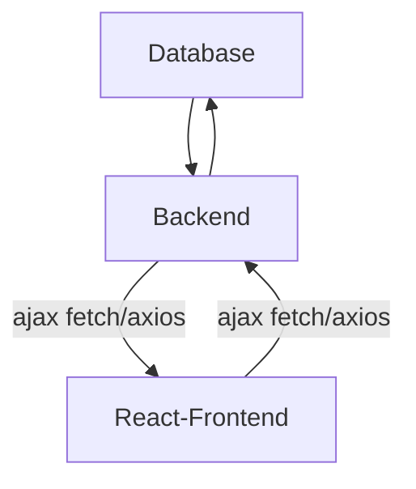

# Why we use Ajax in ReactJs

## Architecture

## Explaination

### AJAX/Fetch/Axios Communication

AJAX, Fetch, or Axios are JavaScript-based methods used for asynchronous communication between the frontend and backend.
These methods allow the frontend to send HTTP requests (e.g., GET, POST, PUT, DELETE) to the backend without reloading the entire page.
The backend receives these requests, processes them (sometimes querying the database), and responds with the necessary data.

### Data Flow

The frontend requests data (e.g., user details, products) from the backend via AJAX/Fetch/Axios.
The backend communicates with the database, retrieves the required data, and sends it back to the frontend.
Similarly, when a user submits data (e.g., form data), the frontend sends it to the backend, which then processes and stores it in the database.

### Use Cases

When a user loads a page, the frontend makes a GET request via fetch or Axios to the backend, which retrieves the necessary data from the database.
When a user submits a form (like creating a new record), the frontend sends a POST request to the backend, which then stores the data in the database.
